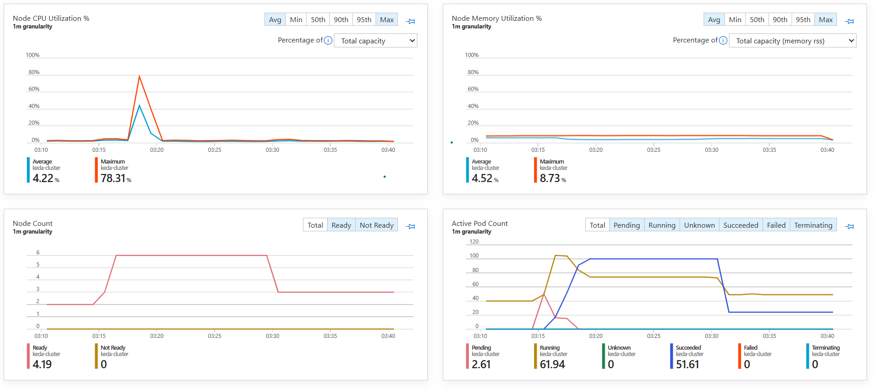

# KEDA-AKS-Queue-Storage
Example setup to trigger jobs on AKS to consume and process messages from Azure Queue Storage with KEDA.  
  
The following example will add 100 messages to Queue Storage. KEDA will watch the queue and start Kubernetes Jobs to calculate the n-th Fibonacci number recursively (load simulation).

You can set up your AKS cluster's user nodepool with autoscaler to always scale to 0 node once the queue is processed. The autoscaler will increase the node count when KEDA creates new pods and the scheduler cannot schedule it on any node.

# Prerequisites
- [az cli](https://learn.microsoft.com/en-us/cli/azure/install-azure-cli)  
- Python
## Azure Setup
- Create a [Queue Storage](https://learn.microsoft.com/en-us/azure/storage/queues/storage-quickstart-queues-portal)
- Provision an [AKS cluster](https://learn.microsoft.com/en-us/azure/aks/learn/quick-kubernetes-deploy-cli)
- [Setup KEDA](https://learn.microsoft.com/en-us/azure/aks/keda-deploy-add-on-cli) on your AKS
- Create an [Azure Container Registry](https://learn.microsoft.com/en-us/azure/container-registry/container-registry-get-started-portal?tabs=azure-cli) or use your own registry

## Create the Image for the Kubernetes Job
In case you are using ACR you can build and push the python image to your repository:  
`az acr build --image pyjob --registry <your-acr-instance> --file Dockerfile .
` 

## Create Kubernetes Namespace and Secrets
In this example the connection method to the Queue Storage is with connection string. For that we need to create a secret in Kubernetes:  
- Create namespace: `kubectl create namespace kedajob` 
- Connection string: `--from-literal=AZURE_STORAGE_CONNECTION_STRING='your_connection_string' -n kedajob`  
- Queue name: `kubectl create secret generic queue-name --from-literal=AZURE_STORAGE_QUEUE_NAME='your_queue_name' -n kedajob`

There are [several other authentication options](https://keda.sh/docs/2.11/concepts/authentication), for example using managed identities.

## Apply KEDA Configuration
The `azurequeue_scaledobject_jobs.yaml` contains the KEDA scaler configuration and the authentication details.  
`kubectl apply -f .\azurequeue_scaledobject_jobs.yaml`

## Set Up Local Environment Variables to Manage the Queue
Set the following environment variables (PowerShell)  
- Queue Storage connection string: `$env:AZURE_STORAGE_CONNECTION_STRING="your_connection_string"`
- Queue name: `$env:AZURE_STORAGE_QUEUE_NAME="your_queue_name"`

Restart CLI after setting them.

# Creating Load and Observing the Queue
The setup is complete, you can add messages to the queue and observe KEDA in action. 
  
Use the python files in the `queue_ops` folder to work with the Queue Storage
- `ops-addmsg.py` to add new messages to the Queue Storage
- `ops-clearq.py` to clear the queue
- `ops-qlength.py` to observe the queue length

## Observations
KEDA monitors the Queue Storage every 10 seconds. Once there are messages, the cluster autoscaler will add new nodes based on pending pod count and autoscaling settings. Once the nodes come online the scheduler will schedule the pending pods on them. 

You can observe the KEDA logs by checking the operator logs.  
`kubectl logs <your-keda-operator-pod> -n kube-system`

# Useful Links
- [KEDA Azure Storage Queue trigger](https://keda.sh/docs/2.12/scalers/azure-storage-queue/)
- [KEDA Job Scaling](https://keda.sh/docs/2.11/concepts/scaling-jobs/)
- [KEDA Authentication](https://keda.sh/docs/2.11/concepts/authentication/)
- [Kubernetes Jobs Documentation](https://kubernetes.io/docs/concepts/workloads/controllers/job/)

